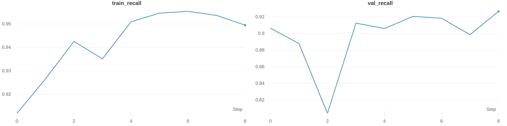
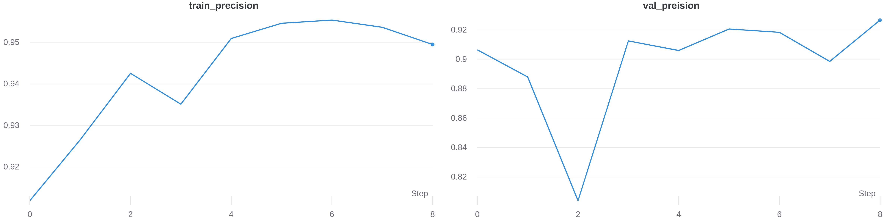

<h3> Covid/Lung/Pneumonia Detection. </h3>

 In today's world of pandemic major challenge is how to know what kind of disease you have, are you suffering from Covid, Lung infection or pneumonia. All these disease attack the lung of a human body, Their are test which can help detect if person have covid or not due to which we can know that person might not have other two disease. But, how much sure are we that the test is accurate, what if the test came to be False negative. Many researcher worked on solving this problem by detecting these type of problem using X-ray. In this work inspired by the work is done by research community, I try to build the model which help in identifying whether one has any of these disease. 

<h3> Installation. </h3>
<ul>
  <li> Python == 3.6.6 </li>
  <li> Pytorch == 1.6.0 </li>
</ul>

<h3> Datasets. </h3>

I didn't upload the dataset used for training validation, but data is taken from https://www.kaggle.com/tawsifurrahman/covid19-radiography-database I want thanks the creator of this dataset. Small changes that you have to do in the dataset after you download and unzip it. Change the name of the folder in the dataset to what is shown below in the list. Left side is original names and right side is changed names.
<ol>
    <li> COVID -> covid</li>
    <li> Normal -> normal </li>
    <li> Lung_Opacity -> lung_opacity</li>
    <li> Viral Pneumonia -> viral_pneumonia </li>
</ol>

<h3> Preprocessing & Architecture. </h3>
 

 When you visualize the dataset it seems pretty imabalanced. To balance the dataset weighted sampling method. I used data argumentation techniques by flipping and  rotating the images. The architecture used is pretty simple, i used pretrained VGG16 network and keep its layer freeze, then append my dense layer for prediction.

<h3> Precision & Recall (Train vs Validation) </h3>
    <figure>
      
      
    </figure>

<h3> Important Note. </h3>

 I am just the beginner and learning about this fascinating field, Please feel free to point out my mistake as well as feel free to contribute. Hope to upload more interesting project in future caio.

